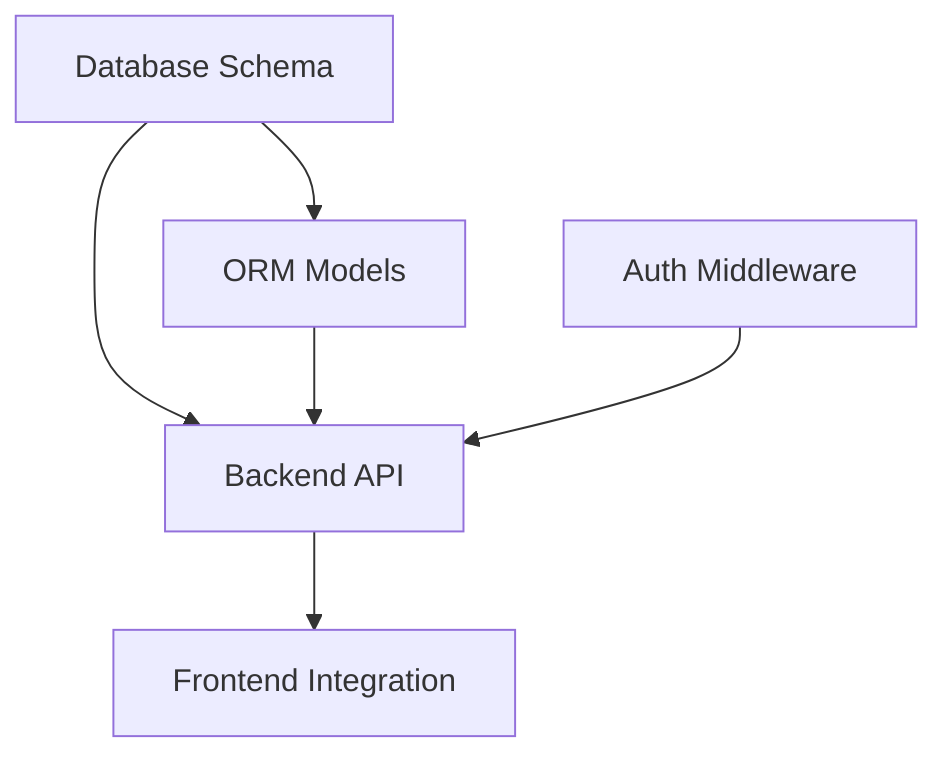

# Phase 2: Task Decomposition

> [!IMPORTANT]
> Uses Opus 4.5 Thinking for deep reasoning on complex planning.

## Purpose

Break complex requests into:

1. Parallel segments (independent tasks)
2. Sequential dependencies
3. Persona assignments
4. Skill loading per segment

---

## Model Selection

**REQUIRED: Claude Opus 4.5 Thinking**

Decomposition requires:

- Architectural understanding
- Dependency mapping
- Risk distribution
- Optimal parallelization

---

## Decomposition Process

### Step 1: Identify Components

Analyze for distinct work areas:

| Domain | Examples |
|--------|----------|
| Frontend | UI components, styling, client logic |
| Backend | API endpoints, server logic, validation |
| Database | Schema, migrations, queries |
| DevOps | Docker, CI/CD, deployment |
| Security | Auth, permissions, validation |
| Testing | Unit, integration, E2E |

### Step 2: Map Dependencies



**Independent** = Can run in parallel
**Dependent** = Must wait for upstream

### Step 3: Create Segments

For each segment:

```yaml
segment:
  id: task-001
  name: "Add user authentication"
  domain: backend
  persona: backend-dev
  model: claude-sonnet-4.5
  dependencies: []
  skills:
    - api-patterns
    - security-auth
  worktree: "$ROOT/worktrees/feat/task-001"
  branch: "feat/task-001-auth"
  estimated_time: "30min"
  risk: medium
```

### Step 4: Assign Personas

| Segment Type | Persona | Model |
|--------------|---------|-------|
| UI/Component | frontend-dev | Sonnet 4.5 |
| API/Logic | backend-dev | Sonnet 4.5 |
| Schema/Query | database-engineer | Sonnet 4.5 |
| Deploy/CI | devops-engineer | Sonnet 4.5 |
| Auth/Secure | security-auditor | Opus 4.5 |
| Tests | test-engineer | Sonnet 4.5 |
| Docs | docs-writer | Flash |
| Review | code-reviewer | Opus 4.5 |

### Step 5: Load Skills

For each segment:

1. Extract keywords from segment description
2. Match to `~/skills/manifest.yaml`
3. Load matched SKILL.md files
4. Apply to segment context

---

## Parallel Groups

Organize segments into execution waves:

```yaml
execution_plan:
  wave_1:  # All parallel
    - task-001-database-schema
    - task-002-auth-design

  wave_2:  # Depends on wave_1
    - task-003-backend-api
    - task-004-middleware

  wave_3:  # Depends on wave_2
    - task-005-frontend
    - task-006-tests
```

---

## Worktree Setup

Per R22 from /atn/baseline:

```bash
# Create worktrees for wave_1
git worktree add "$ROOT/worktrees/feat/task-001" -b feat/task-001-schema
git worktree add "$ROOT/worktrees/feat/task-002" -b feat/task-002-auth

# Verify
git worktree list
```

---

## Output

```yaml
decomposition_result:
  total_segments: N
  waves: N

  segments:
    - id: task-001
      name: "..."
      persona: backend-dev
      model: sonnet-4.5
      dependencies: []
      worktree: "..."
      branch: "..."
      skills: [...]

  execution_plan:
    wave_1: [task-001, task-002]
    wave_2: [task-003]

  total_estimated_time: "X hours"
```

---

## Proceed to Phase 3

Pass decomposition result to Phase 3 (Execute) for parallel execution.
